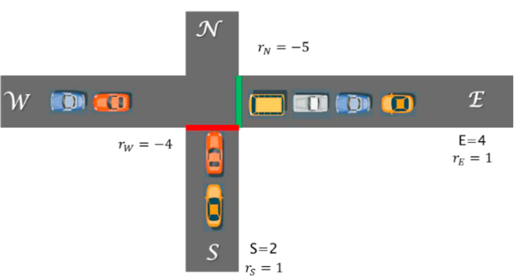
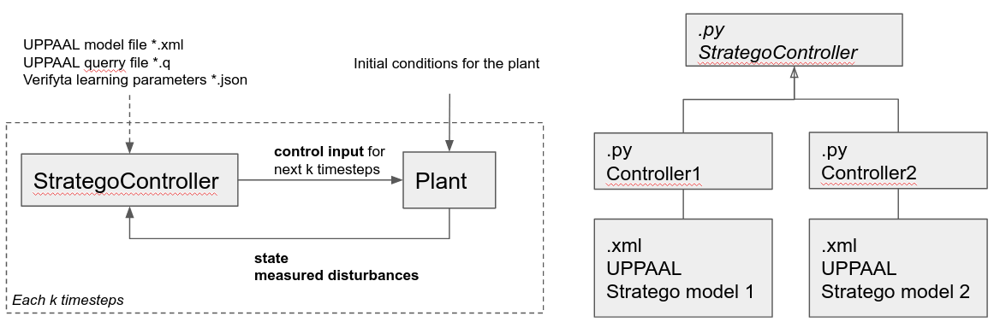

# Stratego MPC example
Minimal example running UPPAAL Stratego as a part of model predictive control MPC loop.

## Example
Describes a toy example traffic control of one way road intersections based on _Eriksen et al., 2020, Controlling Signalized Intersections using Machine Learning_ ([link to paper](https://doi.org/10.1016/j.trpro.2020.08.127)).

  

Corresponding UPPAAL stratego model is found in `uppaal/model.xml`. The task of the MPC control loop iteratively to re-build the model with updated/measured queue lengths `S` and `E`, and calculate optimal control strategy up to horizon. This re-building happends by using `uppaal/model_template.xml` where important variables are commented out with a specific patterns/tags known to the user. `strategoutils.py` then allows to replace those tags with values. For simplicity of the example, measureable disturbances such as vehicle inflow/outflow rates `r` are not inserted back into the model and stay costant.

To run the example use `example.py` script, the only thing you need to customize is the path to UPPAAL Stratego `verifyta` stored in `verifytaPath` variable. 

## Control loop

  

To accomodate shown MPC loop, the project conssts of couple of files:

- `*.xml` template file describing UPPAAL model where changing variables commented out with known tags. Folder `uppaal/` contains original `model.xml`, and `model_template.xml` where variables are substitued by tags.
- `strategoutils.py` small library of generic helper functions to interface with UPPAAL Stratego, used to build interfaces for particular concrete like `model_interface.py`.
- `model_interface.py` leverages `StrategoController` and `strategoutils.py` functions to create the interface to exclusively interact with `model_template.xml`.
- `example.py` that puts it all together and showcases the MPC control loop
- [optional] `*.yaml` configuration file with `verifyta` arguments, in the example default arguments are used
- [optional] `*.q` file specifying Stratego query, in the example query inside `model_template.xml` will be used

This framework allows to insert values in 2 steps, 

## Dependencies

Tested in Python 3.8, dependecies listed in `requirements.txt` and can be installed by either `conda install --file requirements.txt` or `pip install -r requirements.txt`

## Some inserting tricks
Maybe its not a good idea to crete tags that contain `<>` characters, since in `*.xml` file they are written as `&lt;` or `&lt;`, which might lead to confusion. A simplest alternative is just to add `TAG_` in front of your variable name.