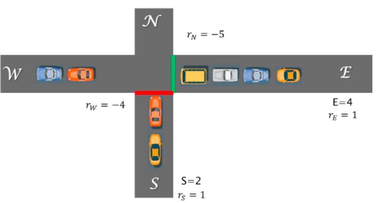

# Traffic light example
This example describes a toy example traffic control of one way road intersections based on _Eriksen et al., 2020, Controlling Signalized Intersections using Machine Learning_ ([link to paper](https://doi.org/10.1016/j.trpro.2020.08.127)).

<p align="center">
  
</p>

## Getting Started

Corresponding UPPAAL stratego model is found in `uppaal/model.xml`. The task of the MPC control loop iteratively to re-build the model with updated/measured south and east queue lengths `S` and `E`, and calculate optimal control strategy up to a horizon. This re-building happends by using `uppaal/model_template.xml` where important variables are commented out with a specific patterns/tags (for example `//TAG_E`) known to the user. [`strategoutil`](https://github.com/mihsamusev/strategoutil.git) then allows to replace those tags with actual values. For simplicity of the example, measureable disturbances such as vehicle inflow/outflow rates `r` are not inserted back into the model and stay costant.

To run the example use `run.py` script. Use `-v` flag to specify the path to UPPAAL Stratego `verifyta` if you have not created a symlink to access `verifyta` command globally.

```sh
python run.py -v <YOUR_VERIFYTA_PATH>
```

## Files included

<p align="center">
  
</p>

To accomodate shown MPC loop, the project consists of couple of files:

- `*.xml` template file describing UPPAAL model where changing variables commented out with known tags. Folder `uppaal/` contains original `model.xml`, and `model_template.xml` where variables are substitued by tags.
- `model_interface.py` that leverages `StrategoController` class and functions of `strategoutil` to create the interface to exclusively interact with `model_template.xml`.
- `run.py` that puts it all together and showcases the MPC control loop
- [optional] `*.yaml` configuration file with `verifyta` arguments, in the example default arguments are used
- [optional] `*.q` file specifying Stratego query, in the example query inside `model_template.xml` will be used